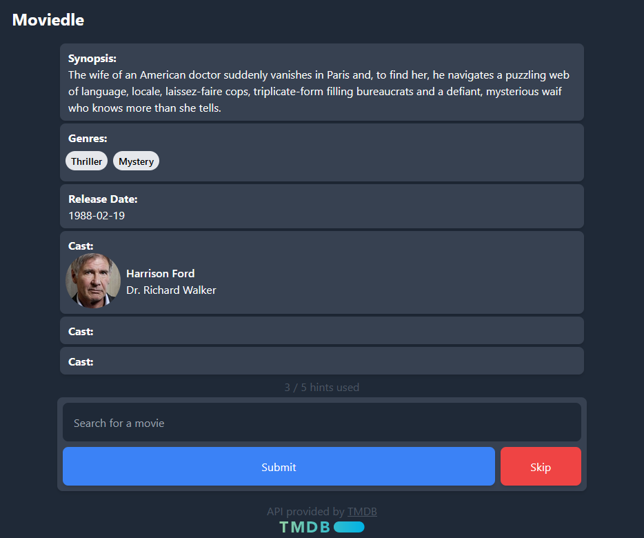

# Moviedle (Name WIP)

This is a project to guess movies based on a series of clues. With the main hint being the movie synopsis.

## How to run

1. Clone the repository
2. Run `npm install`
3. Run `npm run dev`
4. Open your browser and go to `http://localhost:5173`

## How to play

1. Read the synopsis
1. Write the name of the movie
1. Click on the "Submit" button
6. If you guessed right, you will can play again with a new movie
7. If you guessed wrong, you will can keep guessing until you get it right (with more hints)

### Todos (WIP):

- [ ] Add a timer
- [ ] Add a score system (based on time and hints used)
- [ ] Add infinite mode (keep guessing movies until you want to stop - with a score system)

## License

This project is licensed under the MIT License - see the [LICENSE.md](LICENSE.md) file for details