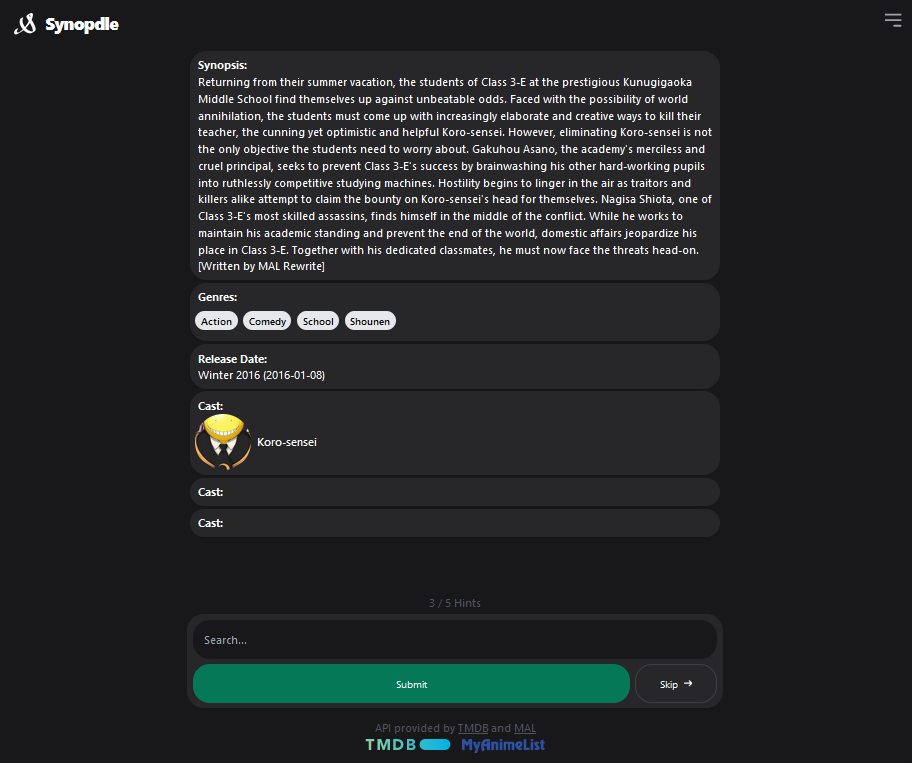

# Synopdle

This is a project to guess movies/tv/anime/manga based on a series of clues. With the main hint being the movie synopsis.

[Synopdle.netlify.app](https://Synopdle.netlify.app/)

## How to play

1. Read the synopsis
1. Write the name of the movie
1. Click on the "Submit" button
6. If you guessed right, you will can play again with a new movie
7. If you guessed wrong, you will can keep guessing until you get it right (with more hints)

## How to run

1. Clone the repository
2. Run `npm install`
3. Run `netlify dev`
4. Open your browser and go to `http://localhost:8888`

## License

This project is licensed under the MIT License - see the [LICENSE.md](LICENSE.md) file for details